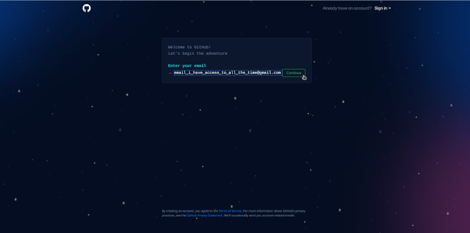

# Introduction to git and GitHub {#intro-git}

## All about git

`git` is a version control system for software development. It allows developers to keep track of changes made to their code and collaborate with other developers on a project. `git` also allows for easy rollbacks and branch management. It is widely used in the software industry and is considered one of the best version control systems available.

`git` was developed by Linus Torvalds in 2005. He created `git` as a replacement for the proprietary version control system he was using at the time. The development of `git` was driven by the need for a distributed version control system, which allows multiple developers to work on a project simultaneously, without the need for a central server. Linus Torvalds is also known for creating the Linux operating system kernel.

To use `git` in your machines, you will need to install it as described in the previous chapter (Chapter \@ref(install-r)).

## All about GitHub

[GitHub](https://github.com) is a web-based platform that provides hosting for software development and a community of developers to collaborate, share and learn from each other. It is built on top of `git`, which is the version control system used for managing and tracking changes to the code. Developers can use GitHub to store and manage their code, collaborate with other developers, and track and manage issues and bugs. It also provides tools for code review, project management, and documentation. It is widely used by developers and organizations to host and share code, as well as to build and maintain open-source software.

GitHub is not a software you need to install. Rather it is a remote or cloud-based server that holds its users' code versioned using the `git` version control system and to which a user's local, git-versioned code syncs/communicates with.

A good illustration of the `git` and `GitHub` relationship can be viewed below:

To use GitHub, you will need create an account at https://github.com.

### Creating a GitHub account

1. Head to https://github.com

2. On the upper right hand corner of the page, click on **Sign-up** button

3. You will be then prompted to provide an email address to register your account with.

With regard to the email address to use for creating a GitHub account, a best practice recommendation is to use an email address that you will have access to all the time. Email addresses such as those for school (if you are a student) or for your current work may not always be the best email address to use as these email addresses tend to be time-limited (i.e., you lose the email address once you graduate or once you leave your current work).

4. You will then be prompted for a password.

5. Then follow all other prompts after this including confirmation of your email and creating a GitHub username.

With regard to creating/selecting a GitHub username, following are some best practice recommendations:

* Incorporate your actual name! People like to know who they’re dealing with. Also makes your username easier for people to guess or remember.

* Pick a username you will be comfortable revealing to your future boss and/or to future collaborators.

* Shorter is better than longer.

* Be as unique as possible in as few characters as possible. In some settings GitHub auto-completes or suggests usernames.

* Make it timeless. Don’t highlight your current university, employer, or place of residence.

* Avoid the use of upper vs. lower case to separate words. We highly recommend all lowercase. GitHub treats usernames in a case insensitive way, but using all lowercase is kinder to people doing downstream regular expression work with usernames, in various languages. A better strategy for word separation is to use a hyphen `-`.

* You can change your username later, but better to get this right the first time.

https://help.github.com/articles/changing-your-github-username/

https://help.github.com/articles/what-happens-when-i-change-my-username/

6. Once you have created a GitHub account, please do share your username to the lecture seriese presenter so he can add your username to the Oxford IHTM GitHub account and add you to the Oxford IHTM GitHub Classroom.

