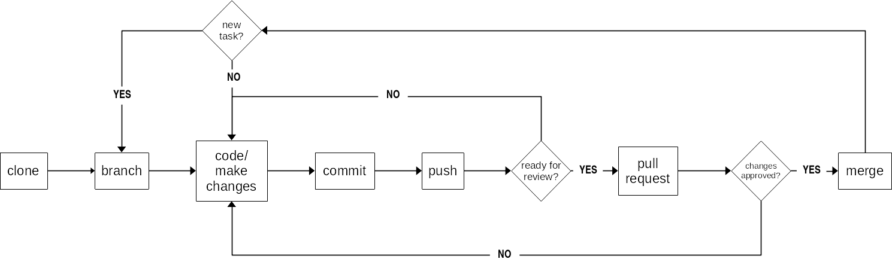

# Participating in an existing R/RStudio project {#participate-projects}

Following are the general steps to take when participating in an existing R/RStudio project that has been initiated and led by someone else.

The following diagram illustrates the steps in this process:

## Clone the project to your local machine

Cloning a project to your local machine is described in Chapter \@ref(clone-repository)

## Create a new branch from the main branch

Before making any changes to the project, create a new branch. 

Name the branch uniquely. The best way to name a branch will be based on how the team/person you are working with prefers to name branches. Some would like the branch name to succinctly describe the type of change that is being made. Some may ask you to name your branch with your username. Some may ask you to name your branch using coded values.

## Code and make changes to your branch

Start coding and implement the changes you want to make or the changes that your collaborator/s asked you to make.

## Commit and push your changes and initiate a pull request

After making changes, you should **commit and push** your changes. This process is described in Chapter \@ref(commit-and-push). Your code and your changes do not have to be complete already for your to commit and push changes. It is good practice to commit and push frequently (at least once a day usually at the end of your coding session). See this as similar to saving your work at multiple stages.

Once your code and the changes you want to make are complete (and ideally that they are working correctly on your local machine), and that you are ready to have your work reviewed, you can now make a **pull request**. This process is also described in Chapter \@ref(commit-and-push).

## Merge pull request

Once your chosen reviewer has seen your work, they may ask you to make changes based on what they see with your code. If so, then start coding again on the same branch and address the reviewers comments, *commit** those changes and *push** the changes to your remote repository. Your changes will push into the same existing open **pull request** that is waiting approval. The reviewer can then view your changes and make the necessary feedback.

Once reviewer approves your changes, they may either merge your pull request themselves or they may let you know in their feedback that they are happy with your changes and that you can now merge your pull request. If so, then click on the **Merge pull request** button.

Your changes have now been integrated into the main branch of the project.
